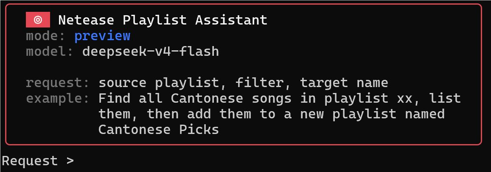
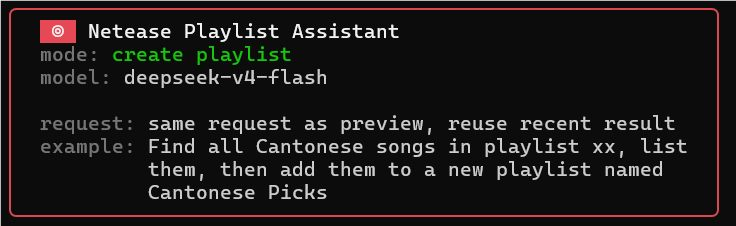
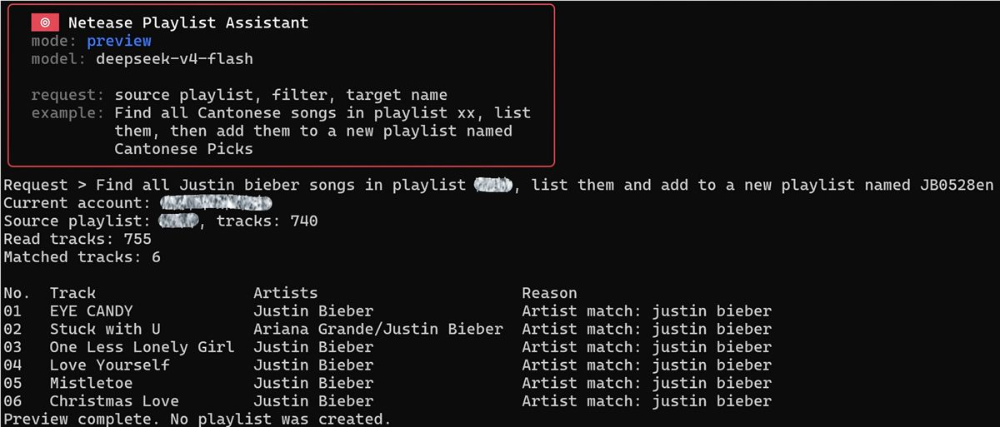
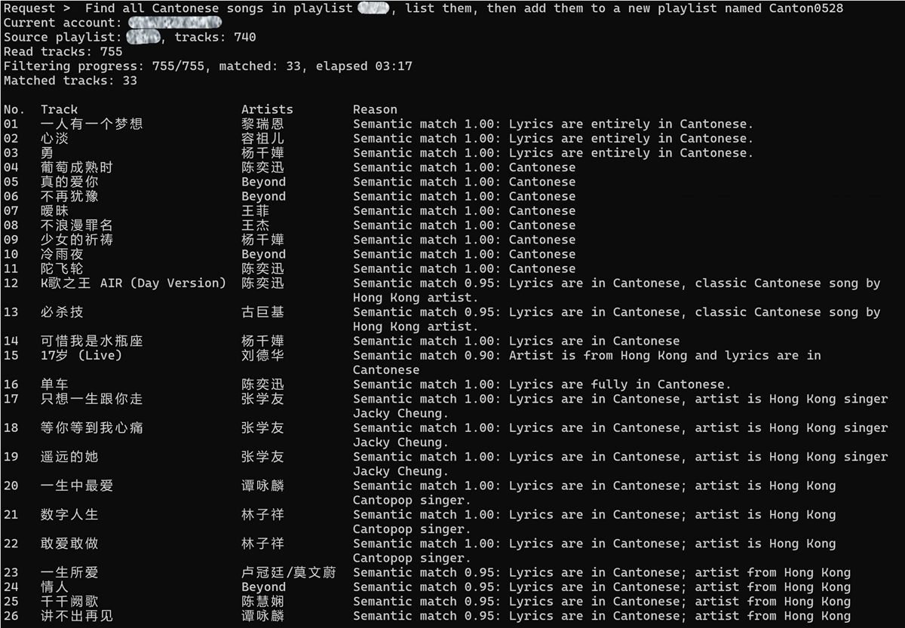
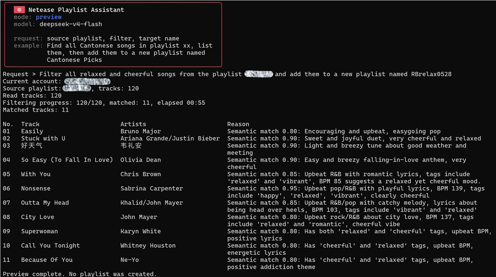
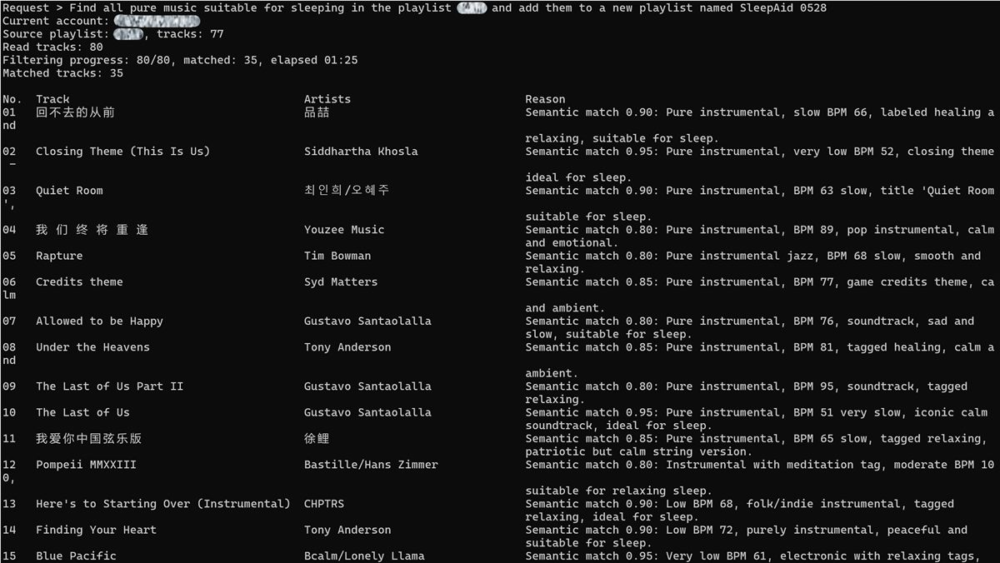
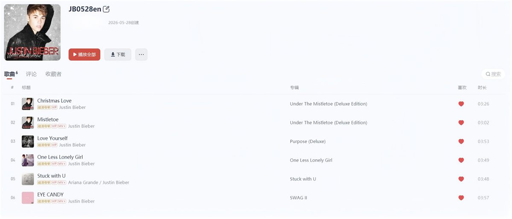
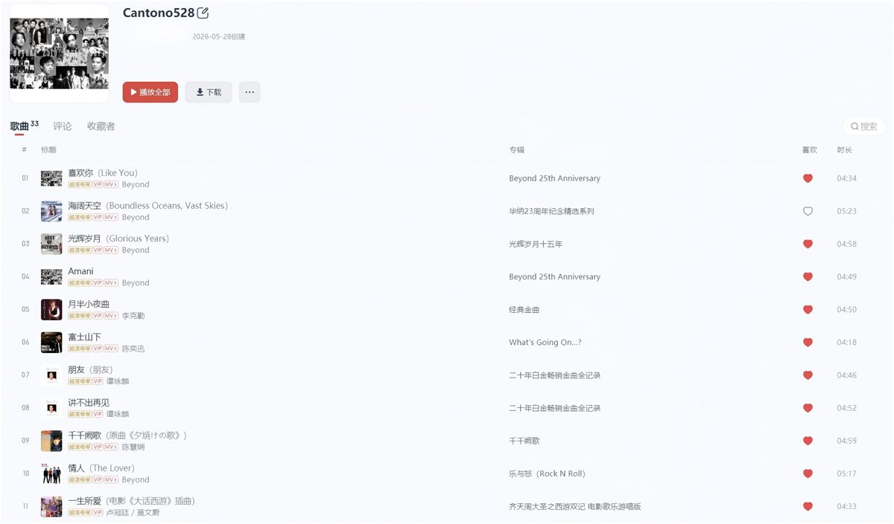
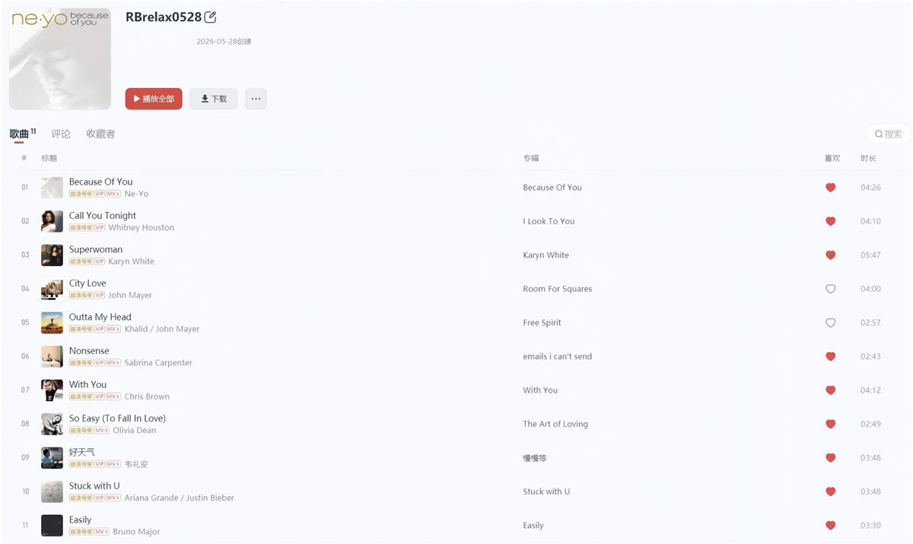
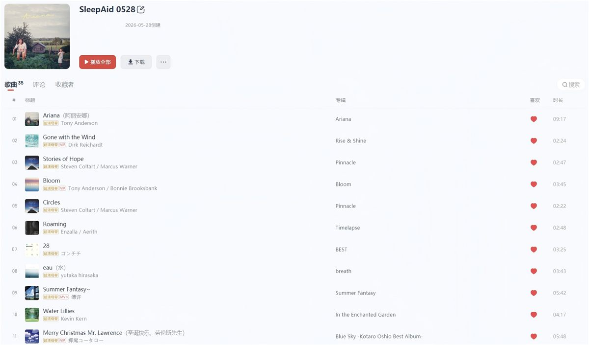

# Netease Playlist Assistant v1.0

[中文](README.md) | English


A local CLI tool that organizes NetEase Cloud Music playlists from plain-language requests.

Large playlists get messy quickly. Cantonese tracks, Japanese songs, English slow songs, workout music, and old favorites all end up in the same place. When you want to pull out one group, manual cleanup means scrolling, clicking, and still missing tracks. This tool handles that workflow: describe the source playlist, the filter, and the new playlist name; preview the matches first; then create the playlist after you confirm the result.

It fits requests like these:

- "Move Coldplay songs from my liked songs into a new playlist"
- "Find Justin Bieber songs in my commute playlist"
- "Collect late-night English slow songs"
- "Pick the first 20 Cantonese songs from a large playlist"

The project is built on top of [Binaryify/NeteaseCloudMusicApi](https://github.com/Binaryify/NeteaseCloudMusicApi). It uses NetEase Cloud Music login, playlist, track, lyric, and music metadata APIs, then wraps them into a personal playlist cleanup workflow.

## Features

- Plain-language playlist cleanup: describe the source playlist, matching rule, and target playlist in one request. Use `preview` to inspect matches, then `run` to create the playlist.
- Fast artist and title matching: handles direct requests such as "Coldplay songs" and "Justin Bieber songs" through local artist-name and alias matching first.
- Language filtering: handles requests such as "Cantonese songs", "Japanese songs", and "English slow songs" by combining track metadata, lyric snippets, and model judgment.
- Scene and style filtering: supports open-ended descriptions such as "English songs for commuting", "late-night R&B", "running tracks", and "2000s Mandarin pop".
- Count limits: supports "first 20 tracks" and "pick 10 songs", preserving the original playlist order for the first N matches.
- QR code login: signs in through the NetEase Cloud Music mobile app and stores the login state locally.
- Local cache: reuses semantic decisions and the latest preview result to reduce repeated requests.
- API scheduling: rate-limits, queues, and retries selected NetEase API calls to reduce failures during heavy operations.

## Requirements

- Node.js 18+
- npm
- macOS, Linux, or Windows terminal
- NetEase Cloud Music account
- API key for an OpenAI Chat Completions-compatible model service; examples default to DeepSeek `deepseek-v4-flash`

## Quick Start

Clone the repository and install dependencies:

```bash
git clone https://github.com/Zion-Johnson99/Netease-Playlist-Assistant-v1.0.git
cd Netease-Playlist-Assistant-v1.0
npm install
```

You can also open the GitHub page, click `Code` -> `Download ZIP`, extract the archive, enter the project directory, and run:

```bash
npm install
```

Copy the environment example and open it.

Windows PowerShell:

```powershell
Copy-Item .env.example .env
notepad .env
```

macOS / Linux:

```bash
cp .env.example .env
nano .env
```

Fill in your model service settings:

```env
DEEPSEEK_API_KEY=sk-your-deepseek-api-key
DEEPSEEK_MODEL=deepseek-v4-flash
DEEPSEEK_BASE_URL=https://api.deepseek.com
```

`DEEPSEEK_API_KEY` is the model service API key. `DEEPSEEK_MODEL` is the model name sent to the API. `DEEPSEEK_BASE_URL` is the model service endpoint. The example points to DeepSeek; other OpenAI Chat Completions-compatible services can use their own endpoint and model name.

DeepSeek API references:

- [DeepSeek API Docs](https://api-docs.deepseek.com/zh-cn/)
- [DeepSeek Platform Docs](https://platform.deepseek.com/docs)

Optional settings:

```env
DEEPSEEK_BATCH_CONCURRENCY=2
DEEPSEEK_BATCH_TIMEOUT_MS=60000
DEEPSEEK_BATCH_RETRIES=1
```

`DEEPSEEK_BATCH_CONCURRENCY` controls semantic matching batch concurrency. `DEEPSEEK_BATCH_TIMEOUT_MS` controls the timeout for each batch request. `DEEPSEEK_BATCH_RETRIES` controls retry attempts after a failed request. The defaults fit common personal playlists; tune them for very large playlists or unstable networks.

Register local commands:

```bash
npm link
```

`npm link` registers this project's `cn`, `en`, `login`, `list`, `model`, `preview`, and `run` commands in your local terminal. For the same cloned directory, one run is usually enough. Run it again after changing machines, cloning again, moving the project directory, or unlinking the package.

You can also run npm scripts inside the project directory:

```bash
npm run login
npm run list
npm run preview
npm run run
```

Set English as the active language:

```bash
en
```

The default language is Chinese. Run `cn` to switch back to Chinese. The active language controls prompts, terminal output, error messages, instruction parsing, and matching reasons for later `preview` and `run` commands.

## Usage

Log in to NetEase Cloud Music:

```bash
login
```

The command prints a QR code in the terminal. Scan it with the NetEase Cloud Music mobile app. The login cookie is stored at `.netease-assistant/cookie.txt`. On the same computer and in the same project directory, later commands reuse this local login state. Log in again when the local cookie expires, is removed, or the environment changes.

List every playlist for the current account:

```bash
list
```

`list` prints an aligned table with playlist number, ID, track count, and playlist name, including "Liked Songs". `cn` / `en` only changes interface labels; playlist names stay in the original text returned by NetEase.

Switch built-in DeepSeek models:

```bash
model -- deepseek-v4-flash
model -- deepseek-v4-pro
```

The default model is `deepseek-v4-flash`. The `model` command switches between the built-in DeepSeek example models. For another compatible model service, update `DEEPSEEK_MODEL` and `DEEPSEEK_BASE_URL` in `.env`.

Preview matching results:

```bash
preview
```



Enter a full request when prompted, for example:

```text
Find all Coldplay songs in my liked songs and create a new playlist named Coldplay Picks
```

Create the playlist after preview:

```bash
run
```



Enter the same full request. After the command finishes, check the created playlist in NetEase Cloud Music.

## Examples

Filter by artist:

```text
Find Coldplay songs in my liked songs and create a playlist named Coldplay
```

```text
Move Justin Bieber songs from my Commute playlist into Justin Bieber Commute
```

Filter by language:

```text
Find all Cantonese songs in my liked songs and create a playlist named Cantonese Picks
```

Filter by scene:

```text
Find late-night English slow songs in my English playlist and create a playlist named Late Night English
```

Common filtering modes:

<table>
  <tr>
    <td><strong>Filter by artist or title</strong><br></td>
    <td><strong>Filter by language</strong><br></td>
  </tr>
  <tr>
    <td><strong>Filter by genre</strong><br></td>
    <td><strong>Filter by scene</strong><br></td>
  </tr>
</table>

Created playlist results:

<table>
  <tr>
    <td><strong>Artist result</strong><br></td>
    <td><strong>Language result</strong><br></td>
  </tr>
  <tr>
    <td><strong>Genre result</strong><br></td>
    <td><strong>Scene result</strong><br></td>
  </tr>
</table>

## How It Works

`artist` uses a local fast path and matches artist names or aliases.

`language` uses DeepSeek with track names, artists, albums, and lyric snippets to judge the actual singing language.

`semantic` uses DeepSeek for genres, moods, eras, scenes, and other open-ended criteria. By default, semantic filtering sends tracks in batches of 30, truncates lyric snippets to 900 characters, and accepts matches with confidence of at least 0.75.

## Local Data

- `.netease-assistant/cookie.txt`: NetEase login cookie.
- `.netease-assistant/config.json`: active language, `cn` or `en`.
- `.netease-assistant/cn/semantic-cache.json`: semantic cache for metadata and model decisions in Chinese mode.
- `.netease-assistant/cn/last-preview.json`: latest preview result in Chinese mode.
- `.netease-assistant/en/semantic-cache.json`: semantic cache in English mode.
- `.netease-assistant/en/last-preview.json`: latest preview result in English mode.
- `.env`: DeepSeek API Key and model settings.

These files are ignored by Git. Before publishing the repository, check that no Cookie, API Key, or personal playlist cache has been committed.

## Development

```bash
npm run typecheck
npm run format:check
npm test
npm run verify
```

`npm run verify` runs type checking, format checking, and tests.

## Acknowledgements

- [Binaryify/NeteaseCloudMusicApi](https://github.com/Binaryify/NeteaseCloudMusicApi): NetEase Cloud Music API capabilities.
- DeepSeek: natural language instruction parsing and semantic filtering.

## License

MIT License
