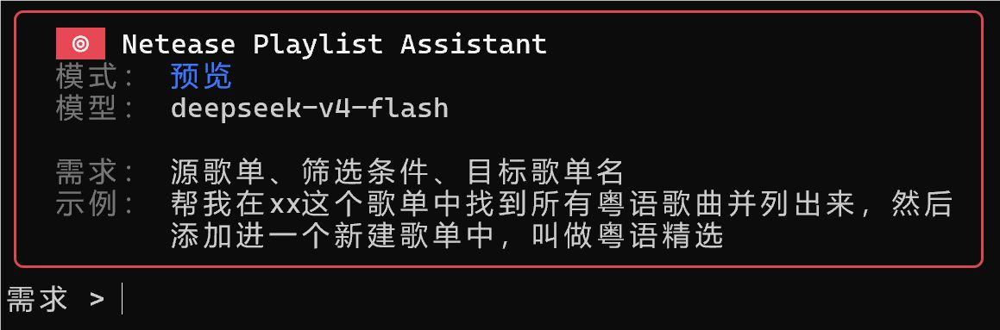
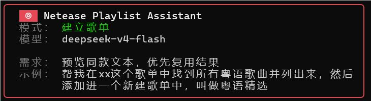
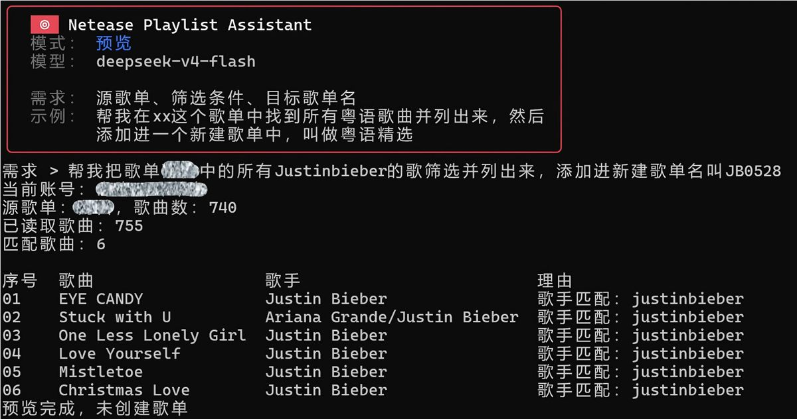
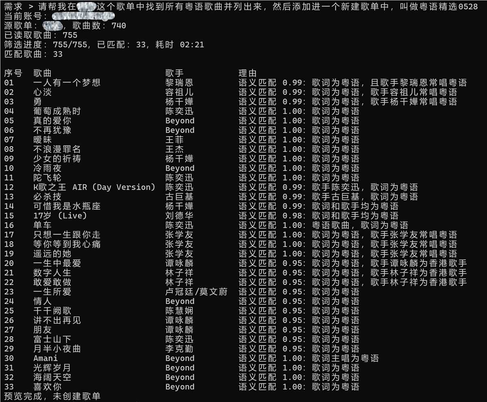
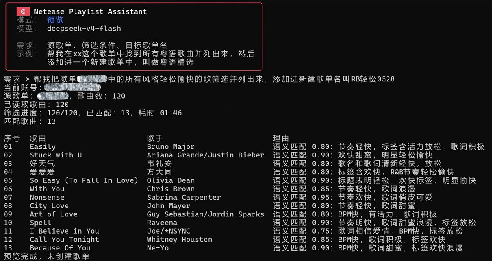
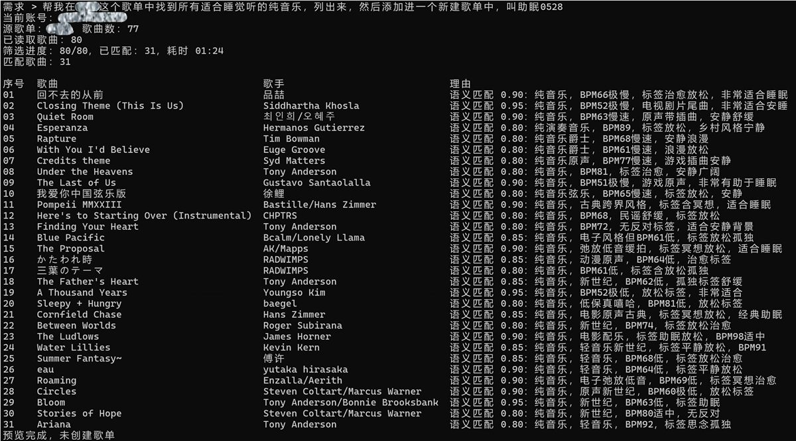
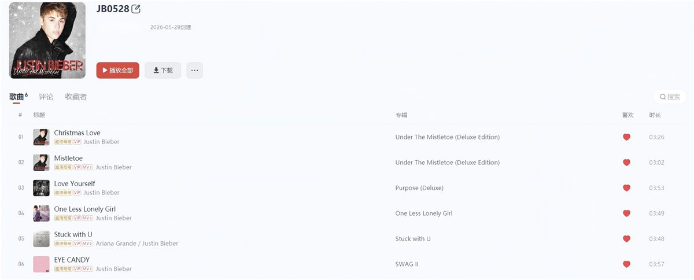
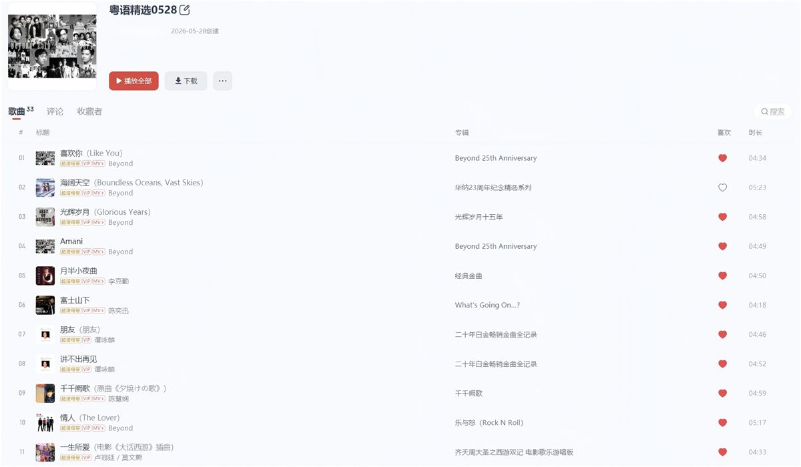
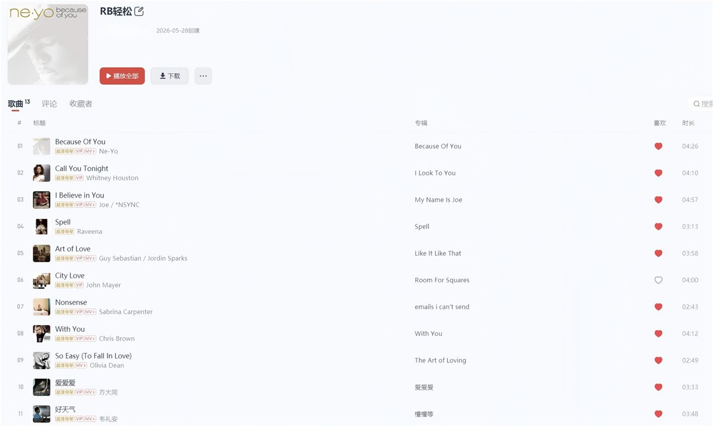
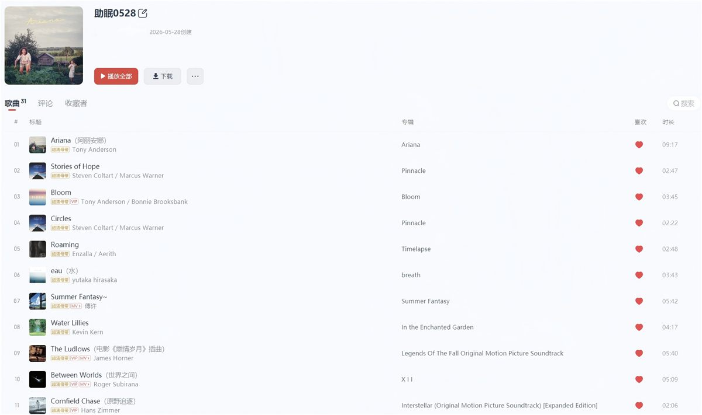

# Netease Playlist Assistant v1.10

中文 | [English](README.en.md)


用自然语言整理网易云音乐歌单的本地 CLI 工具。

歌单一大，整理就容易变成体力活：粤语歌、日语歌、英文慢歌、健身歌、怀旧歌全混在一起，临时想拎出一类，经常要翻很久、点很多次，还容易漏掉几首。这个工具处理的就是这类场景：你说清楚源歌单、筛选条件和新歌单名，它先给出预览，确认后再创建歌单并写入命中的歌曲。v1.10 新增两个已有歌单之间的差集补全，适合把源歌单中目标歌单缺少的歌曲补进去。

它适合这些需求：

- “把我喜欢的音乐里 Coldplay 的歌整理成一个新歌单”
- “从通勤歌单里筛出 Justin Bieber 的歌”
- “找出适合晚上听的英文慢歌”
- “从一个大歌单里挑出前 20 首粤语歌”
- “把纯音乐歌单里中文歌歌单没有的歌补进中文歌歌单”

项目基于 [Binaryify/NeteaseCloudMusicApi](https://github.com/Binaryify/NeteaseCloudMusicApi) 的网易云音乐接口能力构建，在登录、歌单、歌曲、歌词、音乐百科等能力之上，封装出一个面向个人歌单整理的命令行工作流。

## 功能特性

- 自然语言整理歌单：用一句话描述“从哪个歌单筛什么歌，放进哪个新歌单”，`preview` 先看结果，`run` 再执行创建。
- 歌手和歌曲名快速匹配：适合“Coldplay 的歌”“Justin Bieber 的歌”这类明确条件，优先走本地匹配。
- 语种筛选：适合“粤语歌”“日语歌”“英文慢歌”，会结合歌曲信息、歌词片段和模型判断实际演唱语种。
- 场景和风格筛选：适合“通勤听的英文歌”“晚上听的 R&B”“跑步用的快歌”“2000 年代华语歌”等开放描述。
- 数量控制：支持“前 20 首”“筛出 10 首”，按源歌单原始顺序保留命中的前 N 首。
- 已有歌单补全：对比两个已有歌单，按网易云歌曲 ID 列出目标歌单缺少的歌曲，再写入目标歌单。
- 二维码登录：用网易云音乐手机 App 扫码登录，登录状态保存在本地项目目录。
- 本地缓存：复用语义判断和最近一次预览结果，减少重复请求。
- 接口调度：对网易云接口调用做限速、排队和重试，降低高频请求失败率。

## 环境要求

- Node.js 18+
- npm
- macOS、Linux 或 Windows 终端
- 网易云音乐账号
- 兼容 OpenAI Chat Completions 的模型 API Key；示例默认使用 DeepSeek 的 `deepseek-v4-flash`

## 快速开始

克隆仓库并安装依赖：

```bash
git clone https://github.com/Zion-Johnson99/Netease-Playlist-Assistant-v1.10.git
cd Netease-Playlist-Assistant-v1.10
npm install
```

也可以在 GitHub 页面点击 `Code` -> `Download ZIP`，解压后进入项目目录，再执行：

```bash
npm install
```

复制环境变量示例并打开配置文件。

Windows PowerShell：

```powershell
Copy-Item .env.example .env
notepad .env
```

macOS / Linux：

```bash
cp .env.example .env
nano .env
```

填入模型服务配置：

```env
DEEPSEEK_API_KEY=sk-your-deepseek-api-key
DEEPSEEK_MODEL=deepseek-v4-flash
DEEPSEEK_BASE_URL=https://api.deepseek.com
```

`DEEPSEEK_API_KEY` 是模型服务的 API Key。`DEEPSEEK_MODEL` 是实际调用的模型名。`DEEPSEEK_BASE_URL` 是模型服务地址，示例指向 DeepSeek；接入其他兼容 OpenAI Chat Completions 的服务时，按对应服务的地址和模型名填写。

DeepSeek API 文档：

- [DeepSeek API Docs](https://api-docs.deepseek.com/zh-cn/)
- [DeepSeek Platform Docs](https://platform.deepseek.com/docs)

可选配置：

```env
DEEPSEEK_BATCH_CONCURRENCY=2
DEEPSEEK_BATCH_TIMEOUT_MS=60000
DEEPSEEK_BATCH_RETRIES=1
```

`DEEPSEEK_BATCH_CONCURRENCY` 控制语义判断的并发批次数。`DEEPSEEK_BATCH_TIMEOUT_MS` 控制单批请求超时时间。`DEEPSEEK_BATCH_RETRIES` 控制失败后的重试次数。默认值适合普通个人歌单，歌单很大或网络波动明显时再调整。

注册本地命令：

```bash
npm link
```

`npm link` 会把本项目的 `cn`、`en`、`login`、`list`、`model`、`preview`、`run` 注册成本机终端命令。同一个克隆目录通常执行一次即可；换电脑、重新克隆、移动项目目录或取消链接后，需要重新执行。

也可以在项目目录内运行 npm scripts：

```bash
npm run login
npm run list
npm run preview
npm run run
```

设置中文环境：

```bash
cn
```

默认语言是中文。运行 `en` 后切换到英文环境，后续 `preview` 和 `run` 的输入提示、输出文案、错误信息、模型解析和筛选理由都会使用英文；再次运行 `cn` 会切回中文。

## 使用方式

登录网易云：

```bash
login
```

命令会在终端显示二维码。使用网易云音乐手机 App 扫码确认后，登录状态会写入 `.netease-assistant/cookie.txt`。同一台电脑、同一个项目目录下，后续命令会直接复用这份本地登录状态；本地 Cookie 失效、被删除或更换环境时，再重新登录一次即可。

查看当前账号的全部歌单：

```bash
list
```

`list` 会按表格列出歌单序号、ID、歌曲数和歌单名，包含“我喜欢的音乐”。`cn` / `en` 只影响界面文案，歌单名称按网易云返回原文显示。

切换内置 DeepSeek 模型：

```bash
model -- deepseek-v4-flash
model -- deepseek-v4-pro
```

默认模型是 `deepseek-v4-flash`。`model` 命令用于切换项目内置的 DeepSeek 示例模型；接入其他兼容模型时，修改 `.env` 里的 `DEEPSEEK_MODEL` 和 `DEEPSEEK_BASE_URL`。

预览匹配结果：

```bash
preview
```



启动后输入完整需求，例如：

```text
帮我在“我喜欢的音乐”里找到所有 Coldplay 的歌，创建一个新歌单，叫“Coldplay 精选”
```

也支持两个已有歌单之间补全：

<small>preview/run：把“纯音乐”中“中文歌”没有的歌列出来，并添加到“中文歌”</small>

确认后创建新歌单：

```bash
run
```



启动后输入同一条完整需求。运行完成后，可以在网易云音乐里查看创建结果。

## 示例

按歌手筛选：

```text
从“我喜欢的音乐”里找出 Coldplay 的歌，新建歌单叫“Coldplay”
```

```text
把“通勤”歌单里的 Justin Bieber 的歌整理到新歌单“Justin Bieber Commute”
```

按语种筛选：

```text
从“我喜欢的音乐”里筛出所有粤语歌，创建歌单“粤语精选”
```

按场景筛选：

```text
从“英文歌”里找适合晚上听的慢歌，创建歌单“Late Night English”
```

补全已有歌单：

<small>把“纯音乐”中“中文歌”没有的歌列出来，并添加到“中文歌”</small>

常见筛选方式：

<table>
  <tr>
    <td><strong>按歌手或歌曲名筛选</strong><br></td>
    <td><strong>按语种筛选</strong><br></td>
  </tr>
  <tr>
    <td><strong>按曲风筛选</strong><br></td>
    <td><strong>按场景筛选</strong><br></td>
  </tr>
</table>

创建结果：

<table>
  <tr>
    <td><strong>歌手筛选结果</strong><br></td>
    <td><strong>语种筛选结果</strong><br></td>
  </tr>
  <tr>
    <td><strong>曲风筛选结果</strong><br></td>
    <td><strong>场景筛选结果</strong><br></td>
  </tr>
</table>

## 筛选机制

`artist` 走本地快速路径，匹配歌手名和别名，适合明确歌手条件。

`language` 走 DeepSeek 语义路径，结合歌曲名、歌手、专辑、歌词片段等信息判断实际演唱语种。

`semantic` 走 DeepSeek 语义路径，适合曲风、情绪、年代、场景等开放需求。语义筛选默认每批 30 首提交给 DeepSeek，歌词片段截断到 900 字，模型置信度达到 0.75 后进入结果。

`playlist_diff` 对比两个已有歌单，按网易云歌曲 ID 计算“源歌单有、目标歌单缺少”的歌曲；`preview` 只展示缺失列表，`run` 把缺失歌曲添加到目标歌单。

## 本地数据

- `.netease-assistant/cookie.txt`：网易云登录状态。
- `.netease-assistant/config.json`：当前语言环境，`cn` 或 `en`。
- `.netease-assistant/cn/semantic-cache.json`：中文环境的语义筛选缓存，包含歌曲百科摘要和模型判断结果。
- `.netease-assistant/cn/last-preview.json`：中文环境最近一次预览结果。
- `.netease-assistant/en/semantic-cache.json`：英文环境的语义筛选缓存。
- `.netease-assistant/en/last-preview.json`：英文环境最近一次预览结果。
- `.env`：DeepSeek API Key 和模型配置。

这些文件已写入 `.gitignore`。上传 public 仓库前请确认没有提交本地 Cookie、API Key 或个人歌单缓存，避免泄露网易云登录状态和模型服务凭据。

## 开发

```bash
npm run typecheck
npm run format:check
npm test
npm run verify
```

`npm run verify` 会依次执行类型检查、格式检查和测试。

## 致谢

- [Binaryify/NeteaseCloudMusicApi](https://github.com/Binaryify/NeteaseCloudMusicApi)：提供网易云音乐 API 能力。
- DeepSeek：用于自然语言指令解析和语义筛选。

## 开源协议

MIT License
