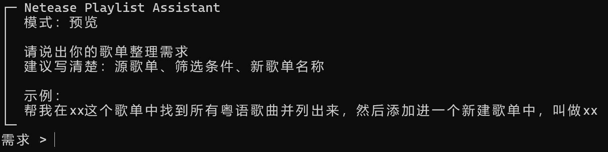
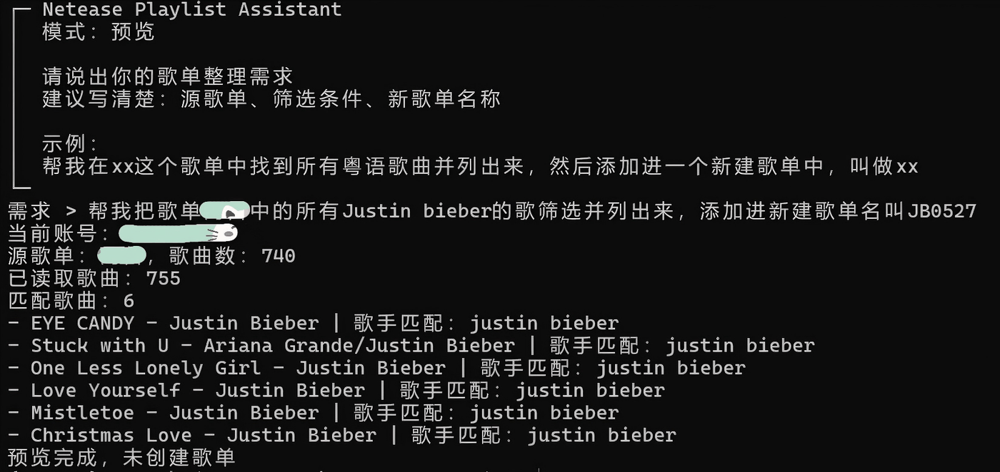
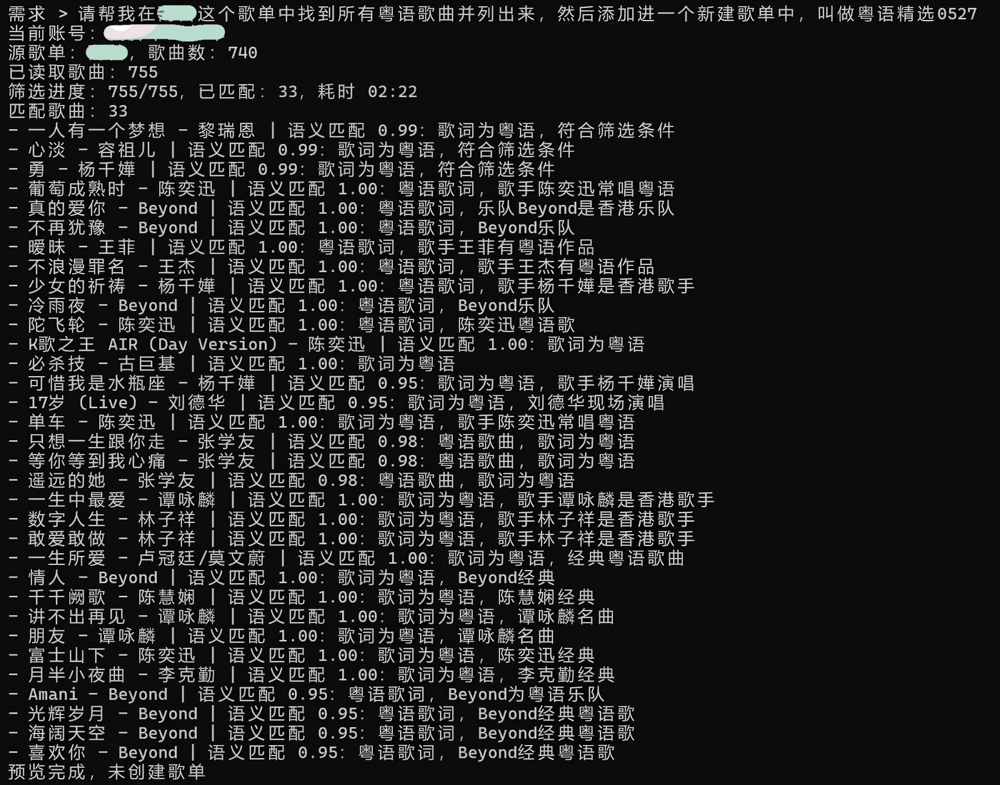
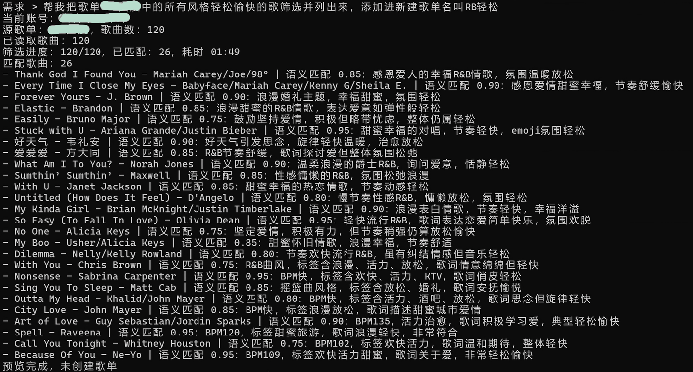
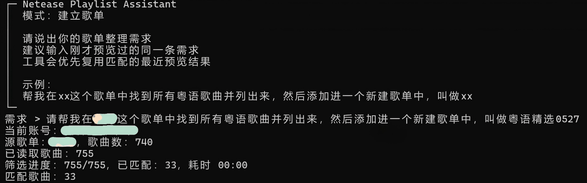
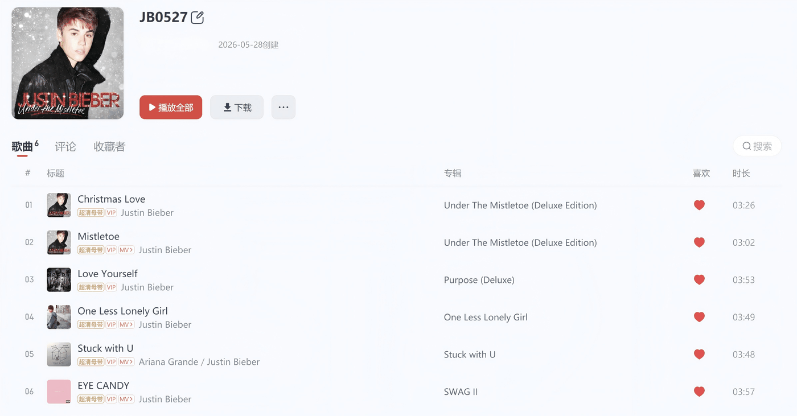
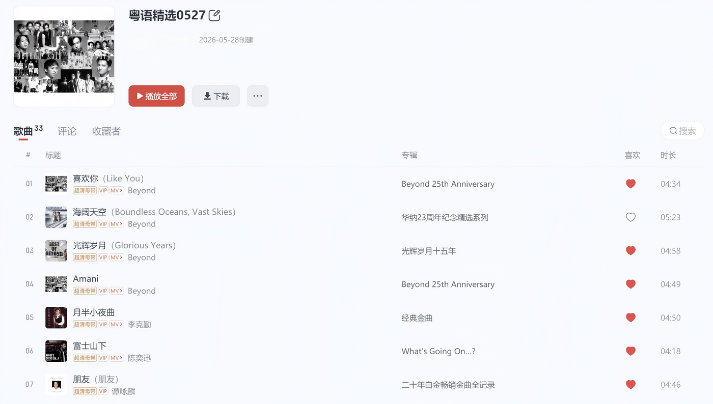

# Netease Playlist Assistant

[中文](#中文) | [English](#english)

## 中文

用自然语言整理网易云音乐歌单的本地 CLI 工具 🎧

歌单一大，整理就很麻烦：粤语歌、日语歌、夜晚慢歌、健身歌全混在一起，临时想单独拎出一类，经常要翻半天、点半天，还容易漏掉几首。比如想把某个歌单里的粤语歌单独放进新歌单，或者把适合通勤的英文歌整理出来，手动处理很快就变成重复劳动。

这个工具专门处理这类歌单整理任务。你只要用自然语言说清楚源歌单、筛选条件和目标歌单，它会先给出预览结果，确认之后再把命中的歌曲整理进新歌单 ✅

这个项目基于 [Binaryify/NeteaseCloudMusicApi](https://github.com/Binaryify/NeteaseCloudMusicApi) 的接口能力构建，在它提供的网易云音乐登录、歌单、歌曲、歌词、音乐百科等接口基础上，封装出一个面向个人歌单整理的命令行工作流。

## 功能特性

- 自然语言指令：直接描述“从哪个歌单筛选什么歌曲，并创建成哪个新歌单”，也支持“我喜欢的音乐”这类默认歌单。
- 二维码登录：通过网易云音乐手机 App 扫码登录，登录状态保存在本地。
- 预览优先：先用 `preview` 查看命中歌曲和理由，再用 `run` 创建新歌单。
- 歌手筛选：本地匹配歌手名与别名，适合“周杰伦的歌”“Justin Bieber 的歌”这类任务。
- 语种筛选：结合歌词片段和 DeepSeek 判断粤语、英语、日语等语种。
- 语义筛选：支持曲风、情绪、场景、年代等开放条件，例如 R&B、Hip-Hop、夜晚英文慢歌、跑步歌单。
- 缓存复用：保存语义判断和最近一次预览结果，减少重复请求。
- 接口调度：对网易云接口调用做限速、排队和重试，降低频繁操作带来的失败率。

## 环境要求

- Node.js 18+
- npm
- macOS、Linux 或 Windows 终端
- 网易云音乐账号
- 兼容 OpenAI Chat Completions 的模型 API Key；默认示例使用 DeepSeek 的 `deepseek-v4-flash`

## 快速开始

```bash
git clone https://github.com/<your-name>/netease-playlist-assistant.git
cd netease-playlist-assistant
npm install
```

复制环境变量示例并打开配置文件。

Windows PowerShell：

```powershell
Copy-Item .env.example .env
notepad .env
```

macOS / Linux：

```bash
cp .env.example .env
nano .env
```

填入你的模型服务配置：

```env
DEEPSEEK_API_KEY=sk-your-deepseek-api-key
DEEPSEEK_MODEL=deepseek-v4-flash
DEEPSEEK_BASE_URL=https://api.deepseek.com
```

`DEEPSEEK_API_KEY` 是模型服务的 API Key。`DEEPSEEK_MODEL` 是实际调用的模型名。`DEEPSEEK_BASE_URL` 是模型服务地址，默认示例指向 DeepSeek；接入其他兼容 OpenAI Chat Completions 的服务时，按对应服务的地址和模型名填写。

DeepSeek API 文档：

- [DeepSeek API Docs](https://api-docs.deepseek.com/zh-cn/)
- [DeepSeek Platform Docs](https://platform.deepseek.com/docs)

可选配置：

```env
DEEPSEEK_BATCH_CONCURRENCY=2
DEEPSEEK_BATCH_TIMEOUT_MS=60000
DEEPSEEK_BATCH_RETRIES=1
```

`DEEPSEEK_BATCH_CONCURRENCY` 控制语义判断的并发批次数。`DEEPSEEK_BATCH_TIMEOUT_MS` 控制单批请求超时时间。`DEEPSEEK_BATCH_RETRIES` 控制失败后的重试次数。默认值适合普通个人歌单，歌单很大或网络波动明显时再调整。

注册本地命令：

```bash
npm link
```

`npm link` 会把本项目的 `cn`、`en`、`login`、`list`、`model`、`preview`、`run` 注册成本机终端命令。同一个克隆目录通常执行一次即可；换电脑、重新克隆、移动项目目录或取消链接后，需要重新执行。

设置中文环境：

```bash
cn
```

默认语言是中文。运行 `en` 后切换到英文环境，后续 `preview` 和 `run` 的输入提示、输出文案、错误信息、模型解析和筛选理由都会使用英文；再次运行 `cn` 会切回中文。

## 使用方式

登录网易云：

```bash
login
```

命令会在终端显示二维码。使用网易云音乐手机 App 扫码确认后，登录状态会写入 `.netease-assistant/cookie.txt`。
同一台电脑、同一个项目目录下，后续命令会直接复用这份本地登录状态，通常不需要反复扫码；本地 Cookie 失效、被删除或更换环境时，再重新登录一次即可。

查看当前账号的全部歌单：

```bash
list
```

`list` 会按表格列出歌单序号、ID、歌曲数和歌单名，包含“我喜欢的音乐”。`cn` / `en` 只影响界面文案，歌单名称按网易云返回原文显示。

可选：切换内置 DeepSeek 模型：

```bash
model -- deepseek-v4-flash
model -- deepseek-v4-pro
```

默认模型是 `deepseek-v4-flash`。`model` 命令用于切换项目内置的 DeepSeek 示例模型；接入其他兼容模型时，修改 `.env` 里的 `DEEPSEEK_MODEL` 和 `DEEPSEEK_BASE_URL`。

预览匹配结果：

```bash
preview
```



启动后在对话框里输入完整需求，例如：

```text
帮我在xx这个歌单中找到所有粤语歌曲并列出来，然后添加进一个新建歌单中，叫做xx
```

常见筛选方式：

按歌手或歌曲名筛选：



按曲风筛选：



按歌曲信息描述筛选：



确认后创建新歌单：

```bash
run
```



启动后输入同一条完整需求。

运行完成后，可以在网易云音乐里查看创建结果：





## 筛选机制

`artist` 走本地快速路径，只匹配歌手名和别名，适合明确歌手条件。

`language` 走 DeepSeek 语义路径，结合歌曲名、歌手、专辑、歌词片段等信息判断实际演唱语种。

`semantic` 走 DeepSeek 语义路径，适合曲风、情绪、年代、场景等开放需求。语义筛选默认每批 30 首提交给 DeepSeek，歌词片段截断到 900 字，模型置信度达到 0.75 后进入结果。

## 本地数据

- `.netease-assistant/cookie.txt`：网易云登录状态。
- `.netease-assistant/config.json`：当前语言环境，`cn` 或 `en`。
- `.netease-assistant/cn/semantic-cache.json`：中文环境的语义筛选缓存，包含歌曲百科摘要和模型判断结果。
- `.netease-assistant/cn/last-preview.json`：中文环境最近一次预览结果。
- `.netease-assistant/en/semantic-cache.json`：英文环境的语义筛选缓存。
- `.netease-assistant/en/last-preview.json`：英文环境最近一次预览结果。
- `.env`：DeepSeek API Key 和模型配置。

这些文件已写入 `.gitignore`，上传 public 仓库前请确认没有提交本地 Cookie、API Key 或个人歌单缓存，务必不要向他人泄露本地网易云 Cookie和自己的 API Key。

## 开发

```bash
npm run typecheck
npm run format:check
npm test
npm run verify
```

`npm run verify` 会依次执行类型检查、格式检查和测试。

## 致谢

- [Binaryify/NeteaseCloudMusicApi](https://github.com/Binaryify/NeteaseCloudMusicApi)：提供网易云音乐 API 能力。
- DeepSeek：用于自然语言指令解析和语义筛选。

## 开源协议

MIT License

---

## English

A local CLI tool for organizing NetEase Cloud Music playlists with natural language 🎧

Large playlists get messy fast: Cantonese tracks, Japanese songs, late-night slow songs, workout music, and old favorites all end up in the same place. When you suddenly want to pull out one category, it often means scrolling for ages, clicking track by track, and still missing a few. Tasks like moving all Cantonese songs into a new playlist or collecting English songs for commuting quickly turn into repetitive work.

This tool is made for that kind of playlist cleanup. Describe the source playlist, the filter, and the target playlist in natural language, preview the matches first, then confirm and move the matched songs into a new playlist ✅

This project is built on top of [Binaryify/NeteaseCloudMusicApi](https://github.com/Binaryify/NeteaseCloudMusicApi). It uses the API capabilities provided by that project, including login, playlists, tracks, lyrics, and song metadata, then wraps them into a personal playlist management workflow.

## Features

- Natural language commands: describe the source playlist, filtering rule, and target playlist in one sentence, including default playlists such as "Liked Songs".
- QR code login: sign in with the NetEase Cloud Music mobile app.
- Preview-first workflow: inspect matched tracks and reasons with `preview`, then create the playlist with `run`.
- Artist filtering: fast local matching for artist names and aliases.
- Language filtering: uses lyrics and DeepSeek to detect languages such as Cantonese, English, and Japanese.
- Semantic filtering: supports genres, moods, scenes, eras, and open-ended music descriptions.
- Local cache: reuses semantic decisions and the latest preview result.
- API scheduling: queues, rate-limits, and retries selected NetEase API calls.

## Requirements

- Node.js 18+
- npm
- macOS, Linux, or Windows terminal
- NetEase Cloud Music account
- An API key for an OpenAI Chat Completions-compatible model service; examples default to DeepSeek `deepseek-v4-flash`

## Quick Start

```bash
git clone https://github.com/<your-name>/netease-playlist-assistant.git
cd netease-playlist-assistant
npm install
```

Copy the environment example and open it.

Windows PowerShell:

```powershell
Copy-Item .env.example .env
notepad .env
```

macOS / Linux:

```bash
cp .env.example .env
nano .env
```

Fill in your model service settings:

```env
DEEPSEEK_API_KEY=sk-your-deepseek-api-key
DEEPSEEK_MODEL=deepseek-v4-flash
DEEPSEEK_BASE_URL=https://api.deepseek.com
```

`DEEPSEEK_API_KEY` is the model service API key. `DEEPSEEK_MODEL` is the model name sent to the API. `DEEPSEEK_BASE_URL` is the model service endpoint; the default example points to DeepSeek, and other OpenAI Chat Completions-compatible services can use their own endpoint and model name.

DeepSeek API references:

- [DeepSeek API Docs](https://api-docs.deepseek.com/zh-cn/)
- [DeepSeek Platform Docs](https://platform.deepseek.com/docs)

Optional settings:

```env
DEEPSEEK_BATCH_CONCURRENCY=2
DEEPSEEK_BATCH_TIMEOUT_MS=60000
DEEPSEEK_BATCH_RETRIES=1
```

`DEEPSEEK_BATCH_CONCURRENCY` controls semantic matching batch concurrency. `DEEPSEEK_BATCH_TIMEOUT_MS` controls the timeout for each batch request. `DEEPSEEK_BATCH_RETRIES` controls retry attempts after a failed request. The defaults fit common personal playlists; tune them for very large playlists or unstable networks.

Register local commands:

```bash
npm link
```

`npm link` registers this project's `cn`, `en`, `login`, `list`, `model`, `preview`, and `run` commands in your local terminal. For the same cloned directory, one run is normally enough; run it again after changing machines, cloning again, moving the project directory, or unlinking the package.

Set English as the active language:

```bash
en
```

The default language is Chinese. Run `cn` to switch back to Chinese. The active language controls prompts, terminal output, errors, instruction parsing, and matching reasons for later `preview` and `run` commands.

## Usage

Log in to NetEase Cloud Music:

```bash
login
```

The command prints a QR code in the terminal. Scan it with the NetEase Cloud Music mobile app. The login cookie is stored at `.netease-assistant/cookie.txt`.
On the same computer and in the same project directory, later commands reuse this local login state directly, so repeated QR scans are usually unnecessary. Log in again only when the local cookie expires, is removed, or the environment changes.

List every playlist for the current account:

```bash
list
```

`list` prints an aligned table with playlist number, ID, track count, and playlist name, including "Liked Songs". `cn` / `en` only changes interface labels; playlist names stay in the original text returned by NetEase.

Optional: switch built-in DeepSeek models:

```bash
model -- deepseek-v4-flash
model -- deepseek-v4-pro
```

The default model is `deepseek-v4-flash`. The `model` command switches between the built-in DeepSeek example models; for another compatible model service, update `DEEPSEEK_MODEL` and `DEEPSEEK_BASE_URL` in `.env`.

Preview matching results:

```bash
preview
```


Enter the full request in the prompt, for example:

```text
Find all Cantonese songs in playlist A and add them to a new playlist named Cantonese Picks
```

Common filtering examples:

Filter by artist or song name:


Filter by genre:


Filter by song description:


Create a playlist after preview:

```bash
run
```


After completion, check the created playlist in NetEase Cloud Music:


## How It Works

`artist` uses a local fast path and matches artist names or aliases.

`language` uses DeepSeek with track names, artists, albums, and lyric snippets to judge the actual singing language.

`semantic` uses DeepSeek for genres, moods, eras, scenes, and other open-ended criteria. By default, semantic filtering sends tracks in batches of 30, truncates lyric snippets to 900 characters, and accepts matches with confidence of at least 0.75.

## Local Data

- `.netease-assistant/cookie.txt`: NetEase login cookie.
- `.netease-assistant/config.json`: active language, `cn` or `en`.
- `.netease-assistant/cn/semantic-cache.json`: semantic cache for metadata and model decisions in Chinese mode.
- `.netease-assistant/cn/last-preview.json`: latest preview result in Chinese mode.
- `.netease-assistant/en/semantic-cache.json`: semantic cache in English mode.
- `.netease-assistant/en/last-preview.json`: latest preview result in English mode.
- `.env`: DeepSeek API Key and model settings.

These files are ignored by Git. Before publishing the repository, check that no Cookie, API Key, or personal playlist cache has been committed.

## Development

```bash
npm run typecheck
npm run format:check
npm test
npm run verify
```

`npm run verify` runs type checking, format checking, and tests.

## Acknowledgements

- [Binaryify/NeteaseCloudMusicApi](https://github.com/Binaryify/NeteaseCloudMusicApi): NetEase Cloud Music API capabilities.
- DeepSeek: natural language instruction parsing and semantic filtering.

## License

MIT License
